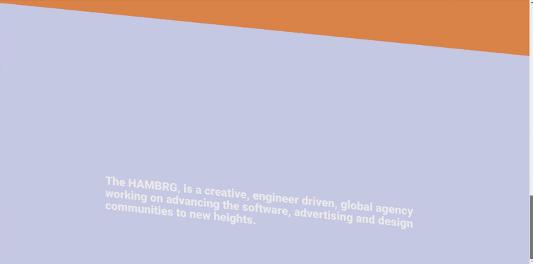

#### TESTING THE MENU 2 AND THE SKEW SCROLL

#### PROBLEM HERE

- I ADDED 3 SECTIONS TO THE HOME . it works perfectly BUT
   

- From the moment you click on the opportunities page (where you only have 1 section) you will see that here is a huge space , this space is related to the 3 sections i added to the HOME

- THIS HAPPENS because the scroll is wrapping the ROUTES(all the routes) in the App.js

#### Another Issue

- When you visualize the black space due to the missing sections inside the "Opportunities", you will say that by refreshing the problem is solved since for a moment the black dissappears, but then you will notice that when you click on the logo to go to home, the home has now just one section(even if it has 3), you can remove it by refreshing agein but then the same issue (black void) starts again with the "opportunites page".

##### SOLUTION

- You either add 3 sections to each page
- or You remove the scroll from the App and add it individually to each page (so to have a custom scroll for each page) and avoid the huge space.

##### I added Bright colors to see the difference

- The black correspond to the scroll (the huge space)

 

 

#### NAVIGATION ISSUES

 

- SINCE I am adding the navigation on top of the routes, I have to keep in mind that I will not have the possibility to tailor the navigation like I did for the old dropdown menu.

 

- I already need to figure it out how to create a 100vh navigation as this one has the header in 100px, the issue here are the z-index , one is at 9 and the other at 10

 

 
 

 

# 🌵 I will continue this project in another repo so to focus on the scroll issue. 🌵

